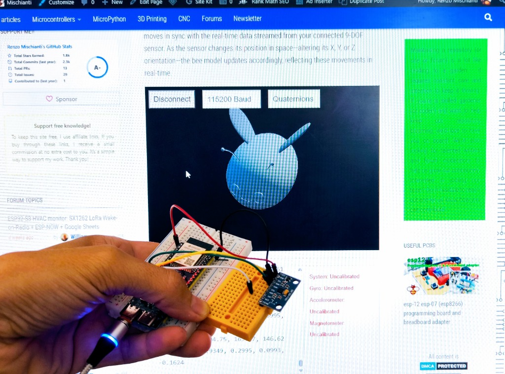

# MPU-6500 DMP Library

**Author:** Renzo Mischianti \
**Website:** [**mischianti.org**](https://mischianti.org/) \
**Arduino Library Registry:** [indexing logs](https://downloads.arduino.cc/libraries/logs/github.com/xreef/MPU-6500-DMP_Library/)

> [!TIP]
> 📖 **Full documentation, wiring diagrams and tutorials are available on [mischianti.org](https://mischianti.org/tdk-invensense-mpu-6500-module-high-resolution-pinout-datasheet-schema-and-specs/).**
> See the [tutorials](#-tutorials-on-mischiantiorg) below for step-by-step guides.

Arduino library for the TDK InvenSense **MPU-6500**, a 6-DOF IMU (3-axis gyroscope + 3-axis accelerometer), with support for the chip's **Digital Motion Processor (DMP)**.

> [!NOTE]
> This library is derived from my [MPU-9250 DMP Library](https://github.com/xreef/MPU-9250-DMP_Library), which in turn is a fork of the **SparkFun MPU-9250 DMP Arduino Library**.
> The MPU-6500 is the same accel/gyro die used inside the MPU-9250, **without the AK8963 magnetometer**, so all magnetometer functions have been removed.

> [!TIP]
> Many modules sold as "MPU-9250" actually mount an MPU-6500. If `WHO_AM_I` (register `0x75`) returns **`0x70`**, you have an MPU-6500 and this is the right library. `0x71` means a genuine MPU-9250: use the [MPU-9250 DMP Library](https://github.com/xreef/MPU-9250-DMP_Library) instead.

---

## Table of Contents

- [📖 Tutorials on mischianti.org](#-tutorials-on-mischiantiorg)
- [Overview](#overview)
- [Repository Contents](#repository-contents)
- [Examples](#examples)
- [Getting Started](#getting-started)
  - [Setting Up the MPU-6500](#setting-up-the-mpu-6500)
  - [Configuring Sensor Settings](#configuring-sensor-settings)
  - [Reading Sensor Data Without FIFO](#reading-sensor-data-without-fifo)
  - [Using the DMP for Orientation Data](#using-the-dmp-for-orientation-data)
- [Differences from the MPU-9250 library](#differences-from-the-mpu-9250-library)
- [Changelog](#changelog)

---

## 📖 Tutorials on mischianti.org

In-depth articles with wiring diagrams for Arduino, ESP32 and other boards, explained examples and troubleshooting tips. The MPU-9250 articles apply to the MPU-6500 for everything except the magnetometer.

| # | Article | Topics |
|---|---------|--------|
| 1 | [TDK InvenSense MPU-6500 module: high-resolution pinout, datasheet, schema and specs](https://mischianti.org/tdk-invensense-mpu-6500-module-high-resolution-pinout-datasheet-schema-and-specs/) | Pinout, datasheet, specs and a `WHO_AM_I` test sketch to tell an MPU-6500 from an MPU-9250 |
| 2 | [MPU9250 with ESP32 and Arduino: Accelerometer, Magnetometer, and Gyroscope via I2C and SPI](https://mischianti.org/mpu9250-with-esp32-and-arduino-accelerometer-magnetometer-and-gyroscope-via-i2c-and-spi/) ([IT Italiano](https://mischianti.org/it/mpu9250-con-esp32-e-arduino-accelerometro-magnetometro-e-giroscopio-tramite-i2c-e-spi/)) | Wiring, I2C and SPI, reading accelerometer and gyroscope, DMP |
| 3 | [MPU9250 with ESP32 and Arduino: interrupt and low power mode](https://mischianti.org/mpu9250-with-esp32-and-arduino-interrupt-and-low-power-mode/) | Data-ready and wake-on-motion interrupts, low power, deep sleep |

### Related tools and articles

- [3D model viewer: visualize Quaternions and Euler Angles from Serial Data in Real-Time](https://mischianti.org/3d-model-viewer-visualize-quaternions-and-euler-angles-from-serial-data-in-real-time/) - view the orientation computed by the DMP live in your browser (see the `WebSerial_3d` example)
- [GY-291 ADXL345 I2C/SPI accelerometer with interrupt for ESP32, ESP8266, STM32 and Arduino](https://mischianti.org/gy-291-adxl345-i2c-spi-accelerometer-with-interrupt-for-esp32-esp8266-stm32-and-arduino/)

### Browse by topic

[MPU9250](https://mischianti.org/tag/mpu9250/) &middot;
[Accelerometer](https://mischianti.org/category/electronic/sensors/accelerometer/) &middot;
[Gyroscope](https://mischianti.org/category/electronic/sensors/gyroscope/)

---

## Overview

Along with configuring and reading from the accelerometer and gyroscope, this library supports the chip's DMP features:

- Quaternion calculation (6-axis)
- Pedometer
- Gyroscope calibration
- Tap detection
- Orientation detection
- Wake-on-motion (low-power accelerometer interrupt)

## Repository Contents

| Path                 | Description                                                                                                  |
|----------------------|--------------------------------------------------------------------------------------------------------------|
| `/examples`          | Example sketches for the library (`.ino`). Run these from the Arduino IDE.                                   |
| `/src`               | Source files for the library (`.cpp`, `.h`).                                                                 |
| `/src/invesense`     | InvenSense Embedded MotionDriver 6.12 driver and DMP image, plus the Arduino I²C/clock/log adapters.         |
| `keywords.txt`       | Keywords from this library that will be highlighted in the Arduino IDE.                                      |
| `library.properties` | General library properties for the Arduino package manager.                                                  |

---

## Examples

Every sketch is in the [`examples`](examples) folder and can be opened from **File > Examples > MPU6500-DMP** in the Arduino IDE.

| Example | What it does | Key API | Notes |
|---------|--------------|---------|-------|
| [`MPU6500_Basic`](examples/MPU6500_Basic) | Polls accelerometer, gyroscope and temperature and prints them on the serial monitor. | `setSensors()`, `setGyroFSR()`, `setAccelFSR()`, `setLPF()`, `setSampleRate()`, `update()`, `calcAccel()`, `calcGyro()` | Start here: it verifies wiring and I2C communication. 10 Hz sample rate, gyro 2000 dps, accel +/-2 g, LPF 5 Hz. |
| [`MPU6500_Basic_Interrupt`](examples/MPU6500_Basic_Interrupt) | Reads accelerometer and gyroscope only when the INT pin signals that new data is ready. | `enableInterrupt()`, `setIntLevel(INT_ACTIVE_LOW)`, `setIntLatched(INT_LATCHED)`, `update()` | **Data-ready interrupt, not a motion interrupt**: the pin fires at the sample rate (4 Hz) even when the sensor is still. For motion use `DMP_wom`. |
| [`MPU6500_DMP_wom`](examples/MPU6500_DMP_wom) | Low-power **Wake-on-Motion**: only the accelerometer is powered and the INT pin goes active when the motion exceeds 40 mg; the sketch then prints the acceleration. | `setSensors(INV_XYZ_ACCEL)`, `setIntLevel()`, `mpu_lp_motion_interrupt()`, `attachInterrupt()`, `dataReady()` | Gyroscope off to save power. Tune the threshold on your hardware. |
| [`MPU6500_FIFO_Basic`](examples/MPU6500_FIFO_Basic) | Reads accelerometer and gyroscope samples from the hardware FIFO instead of polling the registers. | `setSampleRate(100)`, `configureFifo()`, `fifoAvailable()`, `updateFifo()` | Gyroscope and accelerometer are buffered at 100 Hz in the 512-byte hardware FIFO. |
| [`MPU6500_DMP_Quaternion`](examples/MPU6500_DMP_Quaternion) | Uses the DMP to compute the 6-axis quaternion and prints it together with pitch, roll and yaw. | `dmpBegin(DMP_FEATURE_6X_LP_QUAT \| DMP_FEATURE_GYRO_CAL, 10)`, `dmpUpdateFifo()`, `computeEulerAngles()` | Roll and pitch are referenced to gravity; yaw is relative to the start-up heading and drifts slowly. |
| [`MPU6500_DMP_Orientation`](examples/MPU6500_DMP_Orientation) | Detects the orientation of the board (Android-style portrait/landscape) and reports it when it changes. | `dmpBegin(DMP_FEATURE_ANDROID_ORIENT)`, `dmpSetOrientation()`, `dmpGetOrientation()` | The `orientationMatrix` in the sketch maps the sensor axes to the board axes. |
| [`MPU6500_DMP_Pedometer`](examples/MPU6500_DMP_Pedometer) | Counts steps with the DMP pedometer and prints the step count and walking time. | `dmpBegin(DMP_FEATURE_PEDOMETER)`, `dmpSetPedometerSteps()`, `dmpSetPedometerTime()`, `dmpGetPedometerSteps()`, `dmpGetPedometerTime()` | Shake the board up and down at stepping speed; the DMP needs a few consecutive steps (typically 5-7) before it starts counting. |
| [`MPU6500_DMP_Tap`](examples/MPU6500_DMP_Tap) | Detects single and double taps with the DMP, here on the Z axis, and prints the tap direction and count. | `dmpBegin(DMP_FEATURE_TAP, 10)`, `dmpSetTap()`, `tapAvailable()`, `getTapDir()`, `getTapCount()` | Try to reach the maximum count of 8 taps. |
| [`MPU6500_DMP_Gyro_Cal`](examples/MPU6500_DMP_Gyro_Cal) | Lets the DMP calibrate the gyroscope and prints the calibrated gyro values. | `dmpBegin(DMP_FEATURE_GYRO_CAL \| DMP_FEATURE_SEND_CAL_GYRO, 10)`, `dmpUpdateFifo()` | Keep the board still: after about 8 seconds without motion the DMP computes the gyro biases and subtracts them. |
| [`MPU6500_WebSerial_3d`](examples/MPU6500_WebSerial_3d) | Streams quaternion and Euler angles in the format of the **3D Model Viewer**. **[Test it live in your browser](https://mischianti.org/3d-model-viewer-visualize-quaternions-and-euler-angles-from-serial-data-in-real-time/)**. | `dmpBegin(DMP_FEATURE_6X_LP_QUAT \| DMP_FEATURE_GYRO_CAL, 10)`, `dmpUpdateFifo()`, `computeEulerAngles()` | Serial output at 115200 baud in the format expected by the viewer. No magnetometer: yaw is relative to the start-up position and drifts slowly. |

> [!TIP]
> **Try the 3D example in your browser.** Upload `MPU6500_WebSerial_3d`, close the Arduino Serial Monitor so the port is free, then open the [3D Model Viewer page on mischianti.org](https://mischianti.org/3d-model-viewer-visualize-quaternions-and-euler-angles-from-serial-data-in-real-time/) and connect to the board's serial port (115200 baud) with the Web Serial API (Chrome or Edge).

<p align="center">
  <br>
  <em>The MPU sensor driving the 3D Model Viewer in real time through the Web Serial API.</em>
</p>

---

## Getting Started

### Setting Up the MPU-6500

```cpp
#include <MPU6500-DMP.h>

MPU6500_DMP imu;

void setup() {
  Serial.begin(115200);

  // Initialize the MPU-6500 and check if it's connected properly
  if (imu.begin() != INV_SUCCESS) {
    while (1) {
      Serial.println("Unable to communicate with MPU-6500");
      delay(5000);
    }
  }

  // Enable gyroscope and accelerometer
  imu.setSensors(INV_XYZ_GYRO | INV_XYZ_ACCEL);
}
```

### Configuring Sensor Settings

```cpp
// Set gyroscope full-scale range to ±2000 degrees per second (dps)
imu.setGyroFSR(2000);

// Set accelerometer full-scale range to ±2g
imu.setAccelFSR(2);

// Set digital low-pass filter to 5 Hz for smooth data output
imu.setLPF(5);

// Set the sample rate for accelerometer and gyroscope to 10 Hz
imu.setSampleRate(10);
```

| Setting                | Method            | Example value |
|------------------------|-------------------|---------------|
| Gyroscope range        | `setGyroFSR()`    | `2000` dps    |
| Accelerometer range    | `setAccelFSR()`   | `2` g         |
| Low-pass filter        | `setLPF()`        | `5` Hz        |
| Accel/Gyro sample rate | `setSampleRate()` | `10` Hz       |

### Reading Sensor Data Without FIFO

```cpp
void loop() {
  if (imu.dataReady()) {
    // Update accelerometer and gyroscope (the default)
    imu.update(UPDATE_ACCEL | UPDATE_GYRO);

    Serial.println("Accel X: " + String(imu.calcAccel(imu.ax)) + " g");
    Serial.println("Gyro X: "  + String(imu.calcGyro(imu.gx))  + " dps");
  }
}
```

### Using the DMP for Orientation Data

```cpp
void setup() {
  // ... sensor initialization (see above) ...

  // Initialize the DMP to output 6-axis quaternion data at 10 Hz
  imu.dmpBegin(DMP_FEATURE_6X_LP_QUAT | DMP_FEATURE_GYRO_CAL, 10);
}

void loop() {
  if (imu.fifoAvailable()) {
    if (imu.dmpUpdateFifo() == INV_SUCCESS) {
      imu.computeEulerAngles();

      Serial.print("Roll: ");  Serial.println(imu.roll);
      Serial.print("Pitch: "); Serial.println(imu.pitch);
      Serial.print("Yaw: ");   Serial.println(imu.yaw);
    }
  }
}
```

> [!IMPORTANT]
> Without a magnetometer the DMP computes a **6-axis** quaternion. Roll and pitch are referenced to gravity and stay stable; **yaw is relative to the start-up heading and drifts slowly over time**. If you need an absolute heading, add an external magnetometer or use an MPU-9250.

---

## Differences from the MPU-9250 library

| MPU-9250 DMP Library                              | MPU-6500 DMP Library                    |
|---------------------------------------------------|-----------------------------------------|
| `#include <MPU9250-DMP.h>`                        | `#include <MPU6500-DMP.h>`              |
| `MPU9250_DMP imu;`                                | `MPU6500_DMP imu;`                      |
| `mx`, `my`, `mz`, `heading`                       | removed                                 |
| `updateCompass()`, `calcMag()`                    | removed                                 |
| `getMagFSR()`, `getMagSens()`                     | removed                                 |
| `setCompassSampleRate()`, `getCompassSampleRate()`| removed                                 |
| `computeCompassHeading()`                         | removed                                 |
| `UPDATE_COMPASS`, `INV_XYZ_COMPASS` in `setSensors`| not used                               |
| `update()` default: accel + gyro + compass        | `update()` default: accel + gyro        |
| `WHO_AM_I` = `0x71`                               | `WHO_AM_I` = `0x70`                     |

---

## Changelog

| Date       | Version | Notes                                                          |
|------------|---------|----------------------------------------------------------------|
| 2026-09-29 | 1.0.0   | First release: MPU-6500 port of the MPU-9250 DMP Library       |

---

<p align="center">
  Made by <b>Renzo Mischianti</b> · More tutorials, libraries and projects at <a href="https://mischianti.org/"><b>mischianti.org</b></a>
</p>
